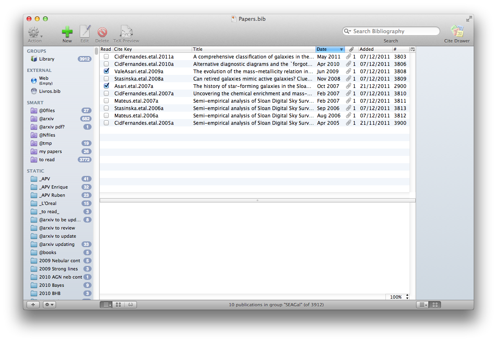

# BibDesk/ADS quick start guide

Natalia@UFSC - 07/May/2013

## First time setup

1) Install Bibdesk from: [http://bibdesk.sourceforge.net/](http://bibdesk.sourceforge.net/)

2) Download & install ads_bibdesk scripts. From the terminal, run:

      git clone https://github.com/wschoenell/ads_bibdesk.git 
      mkdir -p ~/Library/Services
      cp -pr "ads_bibdesk/build/contrib/Add to BibDesk.workflow" "ads_bibdesk/build/contrib/Tabs to BibDesk.workflow" ~/Library/Services/
      cd ads_bibdesk/
      python build.py
      cd build/adsbibdesk
      python setup.py install

3) Create an empty bibtex file and choose where to store your pdf files. From the terminal:

      mkdir -p ~/Papers  
      touch ~/Papers/Papers.bib

4) Configure Bibdesk to open your .bib file.

   Open Bibdesk  
   > Open Bibdesk Preferences (CMD-,)   
   > General  
   > choose "Open File"   
   > find "~/Papers/Papers.bib"

5) Quit Bibdesk. Change some preferences by running the commands below from the terminal:

      # Cite Key
      defaults write -app BibDesk "Cite Key Autogenerate" 1
      defaults write -app BibDesk "Cite Key Format Preset" 0
      defaults write -app BibDesk "Cite Key Format" -string "%f{Mnrascitekey}%u1"
      defaults write -app BibDesk "Cite Key Clean Braces or TeX" 2     
      defaults write -app BibDesk "Default Fields" '( Keywords, Mnrascitekey, Natkeywords )'
      
      # AutoFile
      defaults write -app BibDesk "File papers into the papers folder automatically" 1
      defaults write -app BibDesk BDSKLocalFileFormatPresetKey 0
      defaults write -app BibDesk BDSKLocalFileFormatKey -string "%Y/%f{Cite Key}%n0%e"
      defaults write -app BibDesk "Path to the papers folder" ""
      
      # Backup
      defaults write -app BibDesk BDSKShouldAutosaveDocumentKey 1
      defaults write -app BibDesk BDSKAutosaveTimeIntervalKey 60

      # Window configuration
      defaults write -app BibDesk "Boolean fields" '( Read )'

      # Turn off automatic updates
      defaults write -app BibDesk SUEnableAutomaticChecks 0

      # Shortcuts
      defaults write -app BibDesk NSUserKeyEquivalents '{ "Open Linked Files" = "@~o";}'
      defaults write pbs NSServicesStatus -dict-add '"(null) - Add to BibDesk - runWorkflowAsService"' '{key_equivalent = "@~n";}'

6) Import a few papers. Open some ADS links on Chrome, e.g.:

* [http://adsabs.harvard.edu/abs/2008MNRAS.391L..29S](http://adsabs.harvard.edu/abs/2008MNRAS.391L..29S)
* [http://adsabs.harvard.edu/abs/2006MNRAS.371..972S](http://adsabs.harvard.edu/abs/2006MNRAS.371..972S)

Now select Chrome > Services > Tabs to BibDesk. All the tabs in Chrome open will be imported to BibDesk.

7) BibDesk should have opened automatically and imported your papers. Take a look at the preferences (CMD-,), specially "Cite Key" and "AutoFile" to understand what they do.

8) Tweak Bibdesk as you'd like, mainly the columns that are shown (choose columns using a secondary click on the column titles), smart and static folders. My current configuration is below.

## Day-to-day usage

1) Batch importing: Open a few ADS and arxiv links on Chrome, e.g.:

* [http://adsabs.harvard.edu/abs/2011MNRAS.413.1687C](http://adsabs.harvard.edu/abs/2011MNRAS.413.1687C)
* [http://arxiv.org/abs/0912.1643](http://arxiv.org/abs/0912.1643)
* [http://adsabs.harvard.edu/abs/2007MNRAS.375L..16C](http://adsabs.harvard.edu/abs/2007MNRAS.375L..16C)

Now select Chrome > Services > Tabs to BibDesk. All the tabs in Chrome open will be imported to BibDesk.

2) Importing a single paper: Select an ADS or arxiv identifier or URL, like the one below:

2005MNRAS.358..363C

Press CMD-ALT-n to import the paper to BibDesk.

3) Select a few papers on your BibDesk and press CMD-ALT-o to open the linked pdf files.

4) Bibdesk should be configured to autosave a backup of your bibtex file. However, don't forget to save it for real (CMD-s) once in a while.

## Advanced features

1) Downloading papers straight from a library/university: You can set a SSH Proxy to download pdfs. Just fill in the following configurations on ~/.adsbibdesk

        ssh_user=arthurdent
        ssh_server=acrux.edu

2) Updating all preprints, or for a range of dates (from the terminal):

        adsbibdesk -u

        adsbibdesk -u --from_date=01/12 --to_date=12/12

Preprint PDFs with notes are saved alongside the journal versions.

3) Generate citekey again: CMD-k

4) File pdfs again: CMD-SHIFT-k

5) Import a directory full of pdfs (needs pdf2json; only works for pdfs with DOIs):

        adsbibdesk -p /path_to_dir/

6) Sometimes the adsbibdesk deletes a paper which has a similar title
and author list when it shouldn't, for instance 2001ApJ...554..778L and
2002ApJ...576..762L. I have coded a work around. First, import one of the papers:

        adsbibdesk 2001ApJ...554..778L

Then import the other one using the debug option:

        adsbibdesk -d 2002ApJ...576..762L

When asked to delete the "repeated" publication, answer No (which is the
default answer):

        @@> Found repeated publications: Li.Draine.2001a
        Delete them [y/N]? [Press enter]

7) If your Bibdesk sometimes crashes for no good reason, check the log
report with "Send crash report". It will most likely have an error that
says

    Terminating app due to uncaught exception 'NSInternalInconsistencyException', reason: 'file:///private/var/folders/q7/k1qqvlg96t1_qnff8ntnkh5w0000gn/T/tmptFN6yw.pdf is not safe for mmap()’.

A work around is to turn off auto filing in Bibdesk by addind this to
~/.adsbibdesk: 

    # auto file?
    auto_file=False

This means that, after importing your references, you have to file your
pdfs manually. Just select your references and use the `CMD-SHIFT-k`
shortcut.

8) Further info at: [http://www.jonathansick.ca/adsbibdesk/index.html](http://www.jonathansick.ca/adsbibdesk/index.html)

